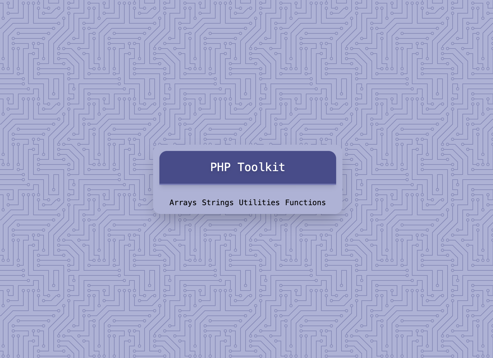
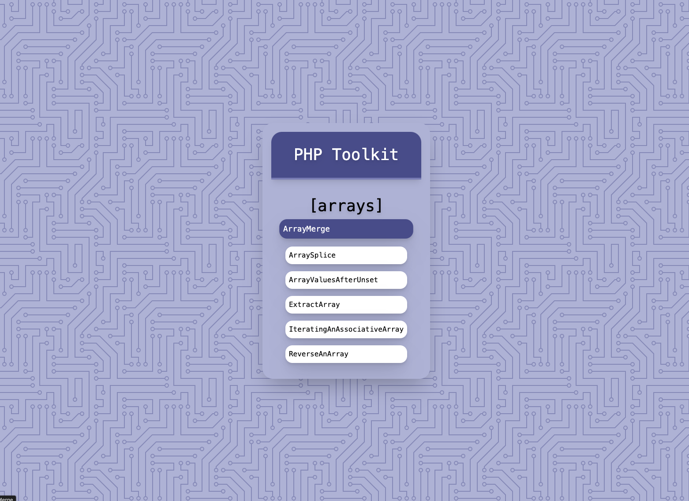
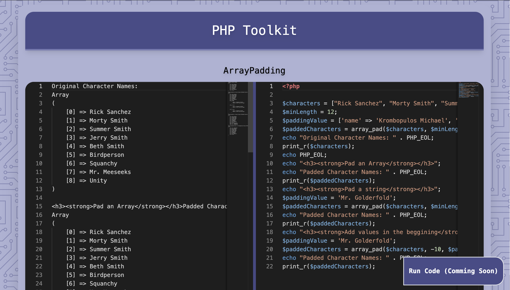

# PHP Toolkit

PHP Toolkit is a resource for PHP funcitonalities. 

The project is brand new. More Info is on its way. 

## Installation
1.Clone the repository

2.cd to the root directory and execute Sail to build the Docker containes like any other Laravel Project. 

    $cd php-toolkit

    $./vendor/bin/sail up

3.Once the build is complete run:

    $npm run dev 

to bundle the frontend. 

## Usage 
The php scirpts are in the directory:
>public/scripts

To expirement with the code, make changes to any file you want and watch the result into the corresponding route. 

## Share your own scripts/examples
If you want to contribute your own examples/scirpts make a php script in one of those folders and create a pull request in order to be added. 

## Future additions 
Since this project is new, I have certain ideas to implement. 

* More custom scripts that go beyond the basic functionalities of PHP functions. 
* Be able to edit and run the code within the browser. 